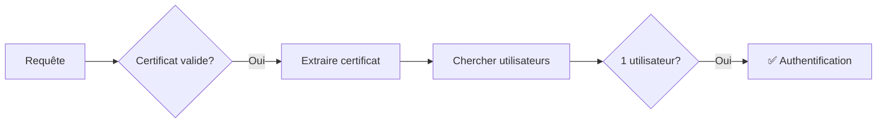
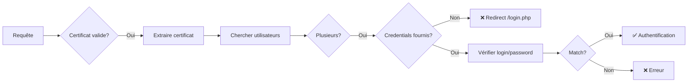
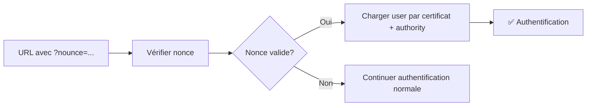

# Architecture d'Authentification X.509

## Vue d'ensemble

Le système d'authentification s'appuie sur **Symfony Security** et utilise des **certificats X.509** pour authentifier les utilisateurs. Cette architecture a été refactorisée selon les principes **Clean Code** pour améliorer la maintenabilité et la testabilité.

## Architecture

L'authentification est structurée autour de 4 composants principaux qui suivent le **principe de responsabilité unique** :

```
┌─────────────────────────────────────────────────────────────────┐
│                      X509Authenticator                          │
│              (Orchestre le processus d'authentification)        │
└───────────────┬─────────────────────────────────────────────────┘
                │
                ├──► CertificateExtractor
                │    (Extraction et validation du certificat)
                │
                ├──► CredentialsExtractor
                │    (Extraction des credentials login/password)
                │
                └──► UserAuthenticationStrategy
                     (Stratégies d'authentification des utilisateurs)
```

### 1. X509Authenticator (`src/Security/X509Authenticator.php`)

**Responsabilité** : Orchestrateur principal du processus d'authentification.

**Méthodes clés** :
- `supports(Request)` : Détermine si l'authentificateur doit traiter la requête
- `authenticate(Request)` : Exécute le processus d'authentification
- `onAuthenticationSuccess()` : Gère les redirections après succès
- `onAuthenticationFailure()` : Gère les erreurs d'authentification

### 2. CertificateExtractor (`src/Security/CertificateExtractor.php`)

**Responsabilité** : Extraction et validation des informations du certificat X.509.

**Fonctionnalités** :
- Vérifie la présence d'un certificat valide (`SSL_CLIENT_VERIFY === 'SUCCESS'`)
- Extrait les informations du certificat (DN, hash, RGS 2★)
- Gère les certificats RGS 2★ via le header `org-s2low-forward-x509-identification`

**Données extraites** :
```php
[
    'ssl_client_verify' => string,
    'subject_dn' => string,
    'issuer_dn' => string,
    'certificate_hash' => string,
    'ssl_client_cert' => string,
    'certificate_rgs_2_etoiles' => string
]
```

### 3. CredentialsExtractor (`src/Security/CredentialsExtractor.php`)

**Responsabilité** : Extraction des credentials utilisateur (login/password).

**Sources supportées** :
1. **HTTP Basic Auth** : `PHP_AUTH_USER` / `PHP_AUTH_PW`
2. **POST data** : Formulaire de login

### 4. UserAuthenticationStrategy (`src/Security/UserAuthenticationStrategy.php`)

**Responsabilité** : Stratégies d'authentification des utilisateurs.

**3 stratégies disponibles** :

#### a) Authentification par Nonce
```php
authenticateByNonce($certificateHash, $nonce, $login, $hash)
```
- Utilisée pour les liens temporaires sécurisés
- Vérifie le nonce via `NounceSQL::verify()`
- Associe certificat + authorityId

#### b) Authentification par Certificat Seul
```php
authenticateByCertificate($certificateHash, $certificateRgs2)
```
- Recherche les utilisateurs associés au certificat
- ✅ **1 utilisateur trouvé** → Authentification automatique
- ⚠️ **Plusieurs utilisateurs** → Retourne `null` (credentials requis)
- ❌ **Aucun utilisateur** → Exception

#### c) Authentification par Certificat + Credentials
```php
authenticateByCertificateAndCredentials($certificateHash, $certificateRgs2, $login, $password)
```
- Recherche par certificat + login
- Vérifie le mot de passe avec `PasswordHandler`
- ✅ **Match** → Retourne l'utilisateur
- ❌ **Login incorrect** → Exception `login_incorrect`
- ❌ **Password incorrect** → Exception `password_incorrect`

## Flux d'Authentification

### Scénario 1 : Utilisateur unique avec certificat



### Scénario 2 : Plusieurs utilisateurs (disambiguation)



### Scénario 3 : Authentification par Nonce



## Processus Complet

```
1. supports()
   ├─ Certificat valide? ────────────────┐
   ├─ Page login GET? (skip)             │
   └─ User déjà authentifié? (skip)      │
                                          ▼
2. authenticate()                    [NON] → Passe au prochain authenticator
   ├─ Extraire certificat            [OUI] ──┐
   ├─ Tentative 1: Nonce                     │
   │  └─ Paramètres ?nounce/?login/?hash     │
   │     └─ Success? → Return Passport       │
   │                                          ▼
   ├─ Tentative 2: Certificat seul       [Continuer]
   │  └─ 1 user trouvé? → Return Passport   │
   │                                         ▼
   └─ Tentative 3: Certificat + Credentials [Continuer]
      ├─ Credentials fournis?
      │  ├─ NON → Exception "multiple_accounts"
      │  └─ OUI → Vérifier login/password
      │           └─ Success? → Return Passport
      │                       → Exception sinon

3. onAuthenticationSuccess()
   └─ POST sur /login.php? → Redirect '/'
      Sinon → null (continue)

4. onAuthenticationFailure()
   ├─ "multiple_accounts" → Redirect /login.php
   └─ Autre erreur → Redirect /login.php?error=...
```

## Cas d'Usage

### 1. Utilisateur avec certificat unique
- Visite n'importe quelle page avec son certificat
- Authentification automatique (pas de formulaire)

### 2. Utilisateur avec plusieurs comptes
- Visite avec son certificat → Redirect vers `/login.php`
- Saisit login/password dans le formulaire
- Authentification sur le compte correspondant

### 3. Lien d'invitation temporaire
- URL : `/page?nounce=XXX&login=user&hash=YYY`
- Le nonce est vérifié avec l'authorityId
- Association certificat ↔ compte automatique

### 4. Sans certificat
- L'authenticator ne traite pas la requête (`supports() = false`)
- D'autres authenticators peuvent prendre le relais

## Gestion des Erreurs

| Code Erreur          | Signification                          | Redirection                      |
|----------------------|----------------------------------------|----------------------------------|
| `multiple_accounts`  | Plusieurs comptes pour ce certificat   | `/login.php` (formulaire)        |
| `login_incorrect`    | Login inconnu pour ce certificat       | `/login.php?error=login_...`     |
| `password_incorrect` | Mot de passe incorrect                 | `/login.php?error=password_...`  |
| Aucun compte         | Certificat non enregistré              | Exception                        |

## Points Techniques

### Sécurité
- Les mots de passe sont vérifiés via `PasswordHandler::passwordMatchesHash()`
- Les certificats RGS 2★ sont décodés depuis Base64
- Validation stricte : `SSL_CLIENT_VERIFY === 'SUCCESS'`

### Sessions
- Pas de ré-authentification si user déjà en session (sauf POST login ou environnement test)
- Token stocké dans `TokenStorageInterface`

### Logging
- Toutes les tentatives d'authentification sont loguées
- Cas "multiple accounts" tracés avec le nombre de comptes

## Tests

Les tests unitaires se trouvent dans `test/PHPUnit/Security/X509AuthenticatorTest.php` et couvrent :

- ✅ Supports avec/sans certificat
- ✅ Page login (GET) non supportée
- ✅ Authentification avec 1 utilisateur
- ✅ Authentification avec plusieurs utilisateurs + credentials
- ✅ Gestion des erreurs (login/password incorrect)
- ✅ Redirections de succès/échec
