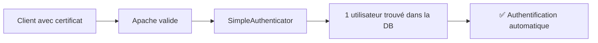
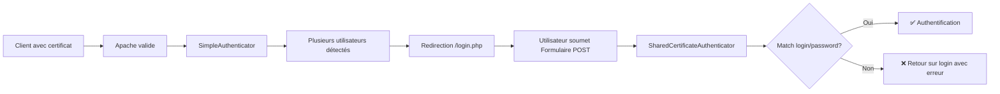
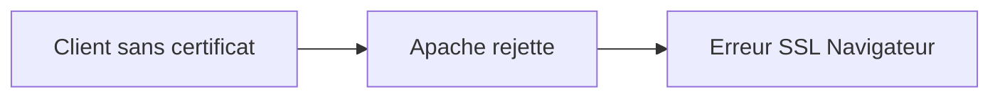

# Architecture d'Authentification X.509

## Vue d'ensemble

L'authentification s'effectue en deux étapes :
1. **Apache** valide le certificat client X.509 et expose les informations au serveur
2. **Symfony Security** utilise ces informations pour identifier et authentifier l'utilisateur via un jeu de **Custom Authenticators**.

```text
┌──────────────────────────────────────────────────────────────────┐
│                         FLUX GLOBAL                              │
└──────────────────────────────────────────────────────────────────┘

 Client HTTPS              Apache                 Symfony Security
    │                        │                           │
    │   Connexion TLS        │                           │
    │  + Certificat X.509    │                           │
    ├───────────────────────>│                           │
    │                        │                           │
    │                        │  Validation du certificat │
    │                        │  (SSLVerifyClient)        │
    │                        │                           │
    │                        │  Variables d'environnement│
    │                        │  SSL_CLIENT_*             │
    │                        ├──────────────────────────>│
    │                        │                           │
    │                        │         Authentification  │
    │                        │   (Simple / Shared / Nounce) │
    │                        │                           │
    │     Page authentifiée  │                           │
    │<───────────────────────┴───────────────────────────┘
```

---

## Étape 1 : Configuration Apache

### Validation du certificat client (VirtualHost :8443)

Apache est configuré pour exiger un certificat client valide sur le port HTTPS 8443 :

```apache
SSLEngine on
SSLVerifyClient require          # Certificat client obligatoire
SSLVerifyDepth 5                 # Profondeur de vérification
SSLCACertificatePath /etc/s2low/ssl/validca
SSLCARevocationPath /etc/s2low/ssl/validca
SSLCARevocationCheck chain       # Vérification CRL
SSLOptions +StdEnvVars +OptRenegotiate +ExportCertData +LegacyDNStringFormat
```

**Résultat** : Apache vérifie que :
- Le certificat est signé par une CA reconnue (`SSLCACertificatePath`)
- Le certificat n'est pas révoqué (CRL)
- La chaîne de certification est valide

### Variables d'environnement exposées

Si la validation réussit, Apache expose les informations via des variables d'environnement PHP :

| Variable               | Description                                   |
|------------------------|-----------------------------------------------|
| `SSL_CLIENT_VERIFY`    | Résultat : `SUCCESS` ou autre                 |
| `SSL_CLIENT_S_DN`      | Subject DN du certificat                      |
| `SSL_CLIENT_I_DN`      | Issuer DN du certificat                       |
| `SSL_CLIENT_CERT`      | Certificat complet en PEM                     |
| `SSL_CLIENT_M_SERIAL`  | Numéro de série (pour calcul du hash)        |

Ces variables sont ensuite lues par le projet via `CertificateExtractor`.

---

## Étape 2 : Symfony Security

### Configuration du firewall (`config/packages/security.yaml`)

```yaml
security:
    providers:
        app_user_provider:
            id: S2low\Security\SecurityUserProvider

    firewalls:
        main:
            lazy: true
            stateless: false
            provider: app_user_provider
            custom_authenticators:
                - S2low\Security\SimpleCertificateAuthenticator
                - S2low\Security\SharedCertificateAuthenticator
                - S2low\Security\NounceAuthenticator
            logout:
                path: app_logout
```

**Principe** : Symfony Security utilise trois **Custom Authenticators** implémentant `AuthenticatorInterface`. Ces authenticators analysent les variables `SSL_CLIENT_*` et d'autres paramètres de la requête pour identifier l'utilisateur.
Le premier Authenticator dont la méthode `supports(Request)` retourne `true` est utilisé pour authentifier la requête.

### Architecture d'Authentification

L'authentification est structurée autour de **3 Authenticators spécifiques** et **2 Extractors** suivant le principe de responsabilité unique :

```text
┌─────────────────────────────────────────────────────────────────┐
│                      Symfony Security                           │
│              (Orchestre les authenticators configurés)          │
└───────────────┬───────────────┬────────────────┬────────────────┘
                │               │                │
                ▼               ▼                ▼
    SimpleCertificate  SharedCertificate   NounceAuthenticator
      Authenticator      Authenticator
                │               │                │
                └───────┬───────┴────────┬───────┘
                        │                │
                        ▼                ▼
            CertificateExtractor     CredentialsExtractor
          (Extraction certificat)  (Extraction Identifiants)
```

---

## Flux d'authentification détaillé

### Cycle de vie d'une requête

```text
┌──────────────────────────────────────────────────────────────┐
│  1. Apache valide le certificat                              │
│     → SSL_CLIENT_VERIFY = 'SUCCESS'                          │
└────────────────────────┬─────────────────────────────────────┘
                         │
                         ▼
┌──────────────────────────────────────────────────────────────┐
│  2. Symfony interroge séquentiellement les Authenticators    │
│                                                              │
│  Lequel retourne supports() === true ?                       │
│                                                              │
│  A. SimpleCertificateAuthenticator :                         │
│     └─ Par défaut pour la majorité des requêtes sans params  │
│        ni identifiants de session fournis en header.         │
│                                                              │
│  B. SharedCertificateAuthenticator :                          │
│     └─ Lors d'un POST sur /login.php ou si présence          │
│        d'auth basique (PHP_AUTH_USER).                       │
│                                                              │
│  C. NounceAuthenticator :                                    │
│     └─ Requêtes contenant le paramètre GET 'nounce'.         │
└────────────────────────┬─────────────────────────────────────┘
                         │
                         ▼
┌──────────────────────────────────────────────────────────────┐
│  3. authenticate() - Traitement selon l'authenticator        │
│                                                              │
│     A. Simple (1 certificat = 1 compte)                      │
│        └─ Recherche comptes par hash certificat              │
│           ├─ 1 compte → Authentification                     │
│           ├─ >1 compte → Exception multiple_accounts         │
│           └─ 0 compte → Exception connection_impossible      │
│                                                              │
│     B. Shared (certificat + credentials)                     │
│        └─ Recherche par certificat_hash ET par login/password (POST)    │
│           ├─ Match → Authentification                        │
│           └─ Erreur → Exception bad_credentials              │
│                                                              │
│     C. Nounce (lien temporaire)                              │
│        └─ Vérifie 'nounce', 'login', et 'hash' via la BDD    │
│           ├─ Valide → Authentification via Certificate/Auth  │
│           └─ Invalide → Exception technique                  │
└────────────────────────┬─────────────────────────────────────┘
                         │
                         ▼
┌──────────────────────────────────────────────────────────────┐
│  4. Résultat                                                 │
│     ✅ Succès → Session créée (redirige vers target_path)    │
│     ❌ Erreur → Redirection selon config (ex: /login.php)    │
└──────────────────────────────────────────────────────────────┘
```

---

## Composants des Authenticators et Extracteurs

### 1. SimpleCertificateAuthenticator
**Rôle** : Gérer la connexion transparente classique lorsqu'un utilisateur possède un certificat correspondant à **un unique compte** sur la plateforme.
- S'assure que la requête n'est pas pour `/login.php`, n'est pas une requête nonce, ni du *Basic Auth*.
- Charge les utilisateurs correspondant au hash de certificat de la requête.
- S'il n'y en a qu'un, il s'authentifie.
- S'il y en a plusieurs, il déclenche l'erreur `multiple_accounts`, ce qui redirige l'utilisateur vers `/login.php` (qui sera elle-même gérée plus tard par `SharedCertificateAuthenticator`).

### 2. SharedCertificateAuthenticator
**Rôle** : Gérer la connexion lorsqu'un certificat correspond à **plusieurs comptes**.
- Répond présent lorsque la requête est faite sur `/login.php` via un POST (formulaire) contenant login/password ou via du *Basic Auth*.
- Combine le hash du certificat avec les identifiants extraits de la requête et demande au `SecurityUserProvider` s'il correspond à un compte valide.

### 3. NounceAuthenticator
**Rôle** : Gérer les connexions via des URLs temporaires ("nonce").
- Répond présent dès que le paramètre GET `nounce` est présent (et idéalement `login`, `hash`).
- Vérifie que le nonce est valide (non consommé/non expiré) via `NounceSQL`.
- Authentifie l'utilisateur via la combinaison certificat et identité liée au nonce (`getUserByCertificatAndAuthority`).

### 4. CertificateExtractor
**Rôle** : Extraction et validation des informations du certificat X.509 depuis la requête.
- Analyse de `SSL_CLIENT_VERIFY` pour certifier que l'échange TLS a validé le document via Apache.
- Extrait le certificat envoyé par `SSL_CLIENT_CERT`.
- Parse le certificat via `openssl_x509_parse` et renvoie une structure de données contenant notamment le **hash du certificat**.

### 5. CredentialsExtractor
**Rôle** : Extraction des credentials utilisateur (login/password).
- Source 1 : HTTP Basic Auth (`PHP_AUTH_USER` / `PHP_AUTH_PW`).
- Source 2 : Payload POST (Formulaire de la page de login).

---

## Scénarios d'authentification

### Scénario 1 : Utilisateur unique avec certificat (SimpleCertificate)



**Expérience utilisateur** : Navigation transparente, pas de formulaire de login.

### Scénario 2 : Plusieurs comptes pour un certificat (SharedCertificate)



**Expérience utilisateur** : Redirection vers formulaire pour choisir le compte, puis retour sur le site authentifié.

### Scénario 3 : Sans certificat



**Expérience utilisateur** : Erreur de connexion au niveau du navigateur (avant d'arriver sur Symfony).

---

## Pont avec le code Legacy (`LegacyAuthenticationBridge`)

Le projet étant une transition depuis un framework "legacy" propriétaire vers l'écosystème Symfony, un service spécifique `LegacyAuthenticationBridge` a été introduit. 
Il aide le code historique (qui ne passe pas tous par la nouvelle stack controller de Symfony) à vérifier l'état d'authentification et récupérer l'entité User portée par PHP/Symfony Security.

Il offre des méthodes comme :
- `isAuthenticated(): bool`
- `getAuthenticatedUserId(): ?int`
- `getAuthenticatedUser(): ?SecurityUser`

Le code en place de l'ancienne base (comme la classe `S2lowLegacy\Class\Authentification`) se repose sur ce pont pour savoir si l'utilisateur est authentifié et synchroniser la session selon l'attendu historique pour la variable de session `id_login` (par ex. pour l'architecture des modules).

---

## Gestion des erreurs et de session

- Pas de ré-authentification si l'utilisateur est déjà en session (géré par le `stateless: false` et le fait que les validatons `supports()` peuvent renvoyer faux si l'utilisateur est déjà loggué).
- Token (`Passport`) stocké par le composant Security dans la `TokenStorageInterface` de Symfony, persistant ainsi à travers la session PHP standard.

Les redirections d'erreur sont prises en charge par la méthode `onAuthenticationFailure()` des authenticators :
- `multiple_accounts` : `SimpleCertificateAuthenticator` redirige vers `/login.php?error=multiple_accounts`.
- `bad_credentials` / `empty_login` : `SharedCertificateAuthenticator` redirige sur `/login.php` avec affichage d'une boîte d'erreur rouge.
- `connection_impossible` / autres problèmes : l'authentificator renvoie sur la page `/connexion-status/`.
