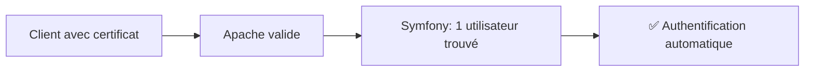
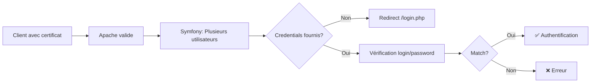
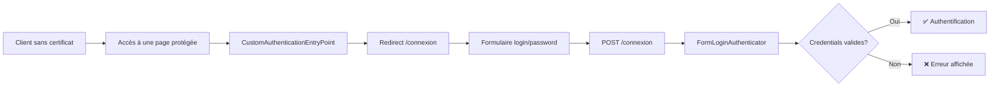
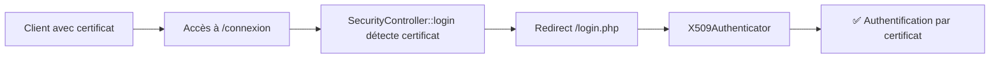

# Architecture d'Authentification S2LOW

## Vue d'ensemble

S2LOW supporte **deux modes d'authentification** :
1. **Authentification par certificat X.509** : Authentification forte via certificat client (Apache + Symfony)
2. **Authentification par login/mot de passe** : Authentification classique via formulaire web (Symfony)

Ces deux modes coexistent et sont gérés par un **chain provider** qui permet de supporter les deux méthodes simultanément

```
┌─────────────────────────────────────────────────────────────────────────┐
│                         FLUX D'AUTHENTIFICATION                         │
└─────────────────────────────────────────────────────────────────────────┘

 Client                    Apache              Symfony Security
   │                          │                       │
   │                          │                       │
   ├─────── Avec certificat ──┼──────────────────────>│
   │          X.509           │  SSL_CLIENT_*         │ X509Authenticator
   │                          │  variables            │ (certificat)
   │                          │                       │
   │                          │                       │
   ├─────── Sans certificat ──┼──────────────────────>│
   │       (ou présence       │                       │ CustomAuthenticationEntryPoint
   │      sur /connexion)     │                       │ → Redirect /connexion
   │                          │                       │
   │                          │                       │ FormLoginAuthenticator
   │      POST /connexion     │                       │ (login/password)
   ├──────────────────────────┼──────────────────────>│
   │    login + password      │                       │
   │                          │                       │
   │                          │                       │
   │    Page authentifiée     │                       │
   │<─────────────────────────┴───────────────────────┘
```

---

## Routes d'authentification

| Route | Méthode | Authentification | Description |
|-------|---------|------------------|-------------|
| `/connexion` | GET | Publique | Affiche le formulaire de connexion par login/mot de passe |
| `/connexion` | POST | Publique | Soumet les credentials (traité par FormLoginAuthenticator) |
| `/login.php` | GET | Publique | Page de connexion par certificat X.509 (legacy) |
| `/login.php` | POST | Publique | Authentification par certificat + credentials si nécessaire |
| `/deconnexion` | GET | Authentifiée | Déconnexion de l'utilisateur |

### Redirections intelligentes

Le système applique des redirections automatiques pour améliorer l'UX :

1. **Utilisateur déjà connecté** → Redirection vers `/`
   - Sur `/connexion` : `SecurityController::login()` vérifie `$this->getUser()`
   - Sur `/login.php` : `AuthenticationHelper::isAuthenticated()` vérifie le token

2. **Certificat présent sur /connexion** → Redirection vers `/login.php`
   - `CertificateExtractor::hasValidCertificate()` détecte le certificat
   - Priorisation de l'authentification par certificat (plus sécurisée)

3. **Pas de certificat et non authentifié** → Affichage du formulaire
   - `CustomAuthenticationEntryPoint` redirige vers `/connexion`

---

## Étape 1 : Configuration Apache (Certificat X.509)

### Validation du certificat client (VirtualHost :8443)

Apache est configuré pour exiger un certificat client valide sur le port HTTPS 8443 :

```apache
SSLEngine on
SSLVerifyClient require          # Certificat client obligatoire
SSLVerifyDepth 5                 # Profondeur de vérification
SSLCACertificatePath /etc/s2low/ssl/validca
SSLCARevocationPath /etc/s2low/ssl/validca
SSLCARevocationCheck chain       # Vérification CRL
SSLOptions +StdEnvVars +OptRenegotiate +ExportCertData +LegacyDNStringFormat
```

**Résultat** : Apache vérifie que :
- Le certificat est signé par une CA reconnue (`SSLCACertificatePath`)
- Le certificat n'est pas révoqué (CRL)
- La chaîne de certification est valide

### Variables d'environnement exposées

Si la validation réussit, Apache expose les informations via des variables d'environnement PHP :

| Variable               | Description                                   |
|------------------------|-----------------------------------------------|
| `SSL_CLIENT_VERIFY`    | Résultat : `SUCCESS` ou autre                 |
| `SSL_CLIENT_S_DN`      | Subject DN du certificat                      |
| `SSL_CLIENT_I_DN`      | Issuer DN du certificat                       |
| `SSL_CLIENT_CERT`      | Certificat complet en PEM                     |
| `SSL_CLIENT_M_SERIAL`  | Numéro de série (pour calcul du hash)        |

Ces variables sont ensuite lues par Symfony.

---

## Étape 2 : Symfony Security (Dual Authentication)

### Configuration du firewall (`config/packages/security.yaml`)

```yaml
security:
    password_hashers:
        S2low\Security\SecurityUser: 'auto'

    providers:
        certificate_user_provider:
            id: S2low\Security\SecurityUserProvider

        password_user_provider:
            id: S2low\Security\PasswordUserProvider

        chain_provider:
            chain:
                providers: ['password_user_provider', 'certificate_user_provider']

    firewalls:
        main:
            lazy: true
            stateless: false
            provider: chain_provider
            entry_point: S2low\Security\CustomAuthenticationEntryPoint
            custom_authenticators:
                - S2low\Security\FormLoginAuthenticator  # Login/password
                - S2low\Security\X509Authenticator       # Certificat X.509
            logout:
                path: /deconnexion
                target: /connexion

    access_control:
        - { path: ^/connexion, roles: PUBLIC_ACCESS }
        - { path: ^/login\.php, roles: PUBLIC_ACCESS }
        - { path: ^/deconnexion, roles: PUBLIC_ACCESS }
        - { path: ^/, roles: IS_AUTHENTICATED_FULLY }
```

**Principe** : Symfony Security utilise **deux Custom Authenticators** et un **chain provider** :
- `FormLoginAuthenticator` : Gère l'authentification par login/mot de passe
- `X509Authenticator` : Gère l'authentification par certificat X.509
- `chain_provider` : Permet aux deux authenticators de coexister
- `CustomAuthenticationEntryPoint` : Redirige vers `/connexion` si non authentifié

### Architecture des authenticators

L'authentification est structurée autour de **deux authenticators principaux** :

```
┌──────────────────────────────────────────────────────────────────────┐
│                     Symfony Security Firewall                        │
│                         (chain_provider)                             │
└────────────────────────┬─────────────────────────────────────────────┘
                         │
           ┌─────────────┴─────────────┐
           │                           │
           ▼                           ▼
┌─────────────────────┐    ┌─────────────────────────┐
│ FormLoginAuth...    │    │  X509Authenticator      │
│ (Login/Password)    │    │  (Certificat X.509)     │
└──────┬──────────────┘    └──────┬──────────────────┘
       │                          │
       │                          ├──► CertificateExtractor
       │                          │    (Validation du certificat)
       │                          │
       ▼                          ├──► CredentialsExtractor
PasswordUserProvider              │    (Extraction login/password)
(Recherche par login)             │
                                  └──► UserAuthenticationStrategy
                                       (Stratégies d'authentification)

                                       ├─► SecurityUserProvider
                                       │   (Recherche par certificat)
                                       │
                                       └─► PasswordUserProvider
                                           (Recherche par login)
```

---

## Flux d'authentification détaillé

### Cycle de vie d'une requête

```
┌──────────────────────────────────────────────────────────────┐
│  1. Apache valide le certificat                              │
│     → SSL_CLIENT_VERIFY = 'SUCCESS'                          │
└────────────────────────┬─────────────────────────────────────┘
                         │
                         ▼
┌──────────────────────────────────────────────────────────────┐
│  2. Symfony Security appelle supports()                      │
│     ├─ Certificat valide?                                    │
│     ├─ Page GET /login.php? (skip)                           │
│     └─ User déjà authentifié? (skip sauf POST login)         │
└────────────────────────┬─────────────────────────────────────┘
                         │ [OUI]
                         ▼
┌──────────────────────────────────────────────────────────────┐
│  3. authenticate() - Tentatives d'authentification           │
│                                                              │
│     A. Nonce (lien temporaire)                               │
│        └─ Paramètres ?nounce/?login/?hash présents?         │
│           → Vérification + association certificat            │
│                                                              │
│     B. Certificat seul                                       │
│        └─ Recherche utilisateurs par hash certificat         │
│           ├─ 1 utilisateur → Authentification immédiate      │
│           └─ Plusieurs → Nécessite credentials              │
│                                                              │
│     C. Certificat + Credentials                              │
│        └─ Login/password fournis?                            │
│           → Vérification via PasswordHandler                 │
└────────────────────────┬─────────────────────────────────────┘
                         │
                         ▼
┌──────────────────────────────────────────────────────────────┐
│  4. Résultat                                                 │
│     ✅ Succès → Session créée                                │
│     ❌ Erreur → Redirection /login.php                       │
└──────────────────────────────────────────────────────────────┘
```

---

## Composants des authenticators

### 1. FormLoginAuthenticator (`src/Security/FormLoginAuthenticator.php`)

**Rôle** : Authentification par login/mot de passe via formulaire web.

**Méthodes clés** :
- `supports(Request)` : Vérifie que la requête est un POST sur `/connexion`
- `authenticate(Request)` : Extrait login/password et crée un Passport
- `onAuthenticationSuccess()` : Redirige vers `/` après succès
- `onAuthenticationFailure()` : Redirige vers `/connexion` avec erreur en session

**Fonctionnement** :
1. Capture le POST du formulaire `/connexion`
2. Extrait `login` et `password` depuis `$request->request`
3. Utilise `PasswordUserProvider::loadUserByIdentifier()` pour charger l'utilisateur
4. Symfony vérifie automatiquement le mot de passe via `PasswordCredentials`
5. En cas de succès, stocke l'utilisateur dans le token de sécurité

**Gestion des erreurs** :
- Login incorrect → `AuthenticationException` stockée en session
- Mot de passe incorrect → `AuthenticationException` stockée en session
- Template affiche l'erreur via `AuthenticationUtils::getLastAuthenticationError()`

### 2. PasswordUserProvider (`src/Security/PasswordUserProvider.php`)

**Rôle** : User provider pour l'authentification par login/mot de passe.

**Méthodes clés** :
- `loadUserByIdentifier(string $login)` : Charge l'utilisateur par son login
- `refreshUser(UserInterface $user)` : Recharge l'utilisateur depuis la base
- `supportsClass(string $class)` : Vérifie la classe `SecurityUser`

**Fonctionnement** :
1. Recherche l'utilisateur dans la base via `UtilisateurSQL::getUserByLogin($login)`
2. Crée une instance de `SecurityUser` avec les données de l'utilisateur
3. Le mot de passe haché est récupéré et vérifié par Symfony automatiquement

### 3. X509Authenticator (`src/Security/X509Authenticator.php`)

**Rôle** : Orchestrateur principal pour l'authentification par certificat X.509.

**Méthodes clés** :
- `supports(Request)` : Détermine si la requête doit être authentifiée par certificat
  - Vérifie la présence d'un certificat valide
  - Ignore `/connexion` et `/connexion/multicompte` (réservés au FormLogin)
  - Vérifie si l'utilisateur n'est pas déjà authentifié
- `authenticate(Request)` : Exécute les stratégies d'authentification
- `onAuthenticationSuccess()` : Gère les redirections après succès
- `onAuthenticationFailure()` : Gère les erreurs et redirections

### 4. CertificateExtractor (`src/Security/CertificateExtractor.php`)

**Rôle** : Extraction et validation des informations du certificat X.509.

**Vérifications** :
- `SSL_CLIENT_VERIFY === 'SUCCESS'`
- Extraction du hash (via `openssl_x509_parse`)
- Support des certificats RGS 2★ via header `org-s2low-forward-x509-identification`

**Données extraites** :
```php
[
    'ssl_client_verify' => 'SUCCESS',
    'subject_dn' => 'CN=...',
    'issuer_dn' => 'CN=...',
    'certificate_hash' => 'A1B2C3...',  // Hash SHA1
    'ssl_client_cert' => '-----BEGIN CERTIFICATE-----...',
    'certificate_rgs_2_etoiles' => '...'  // Optionnel
]
```

### 5. CredentialsExtractor (`src/Security/CredentialsExtractor.php`)

**Rôle** : Extraction des credentials utilisateur (login/password) pour X509Authenticator.

**Sources** :
- HTTP Basic Auth : `PHP_AUTH_USER` / `PHP_AUTH_PW`
- POST data : Formulaire de login (sur `/login.php`)

### 6. UserAuthenticationStrategy (`src/Security/UserAuthenticationStrategy.php`)

**Rôle** : Stratégies d'authentification avec priorité définie.

#### Stratégie A : Authentification par nonce (liens temporaires)
- URL : `/page?nounce=XXX&login=user&hash=YYY`
- Vérifie le nonce via `NounceSQL::verify()` et associe certificat + authorityId

#### Stratégie B : Authentification par certificat seul
```php
authenticateByCertificate($certificateHash, $certificateRgs2)
```
- Recherche les utilisateurs associés au certificat
- ✅ **1 utilisateur** → Authentification automatique
- ⚠️ **Plusieurs utilisateurs** → Retourne `null` (credentials requis)
- ❌ **Aucun utilisateur** → Exception

#### Stratégie C : Authentification par certificat + credentials
```php
authenticateByCertificateAndCredentials($certificateHash, $certificateRgs2, $login, $password)
```
- Recherche par certificat + login
- Vérifie le mot de passe avec `PasswordHandler::passwordMatchesHash()`
- ✅ **Match** → Retourne l'utilisateur
- ❌ **Erreur** → Exception (`login_incorrect` / `password_incorrect`)

### 7. CustomAuthenticationEntryPoint (`src/Security/CustomAuthenticationEntryPoint.php`)

**Rôle** : Point d'entrée personnalisé pour rediriger les utilisateurs non authentifiés.

**Fonctionnement** :
- Appelé automatiquement par Symfony quand un utilisateur non authentifié tente d'accéder à une ressource protégée
- Redirige vers `/connexion` (page de login par mot de passe)
- Permet une expérience utilisateur cohérente

### 8. AuthenticationHelper (`src/Security/AuthenticationHelper.php`)

**Rôle** : Helper pour vérifier l'authentification depuis les pages legacy PHP.

**Méthodes** :
- `isAuthenticated()` : Vérifie si un utilisateur est actuellement authentifié
- `getUser()` : Récupère l'utilisateur authentifié

**Usage** :
```php
// Dans public.ssl/login.php
global $kernel;
$authHelper = $kernel->getContainer()->get('S2low\Security\AuthenticationHelper');
if ($authHelper->isAuthenticated()) {
    header('Location: /');
    exit;
}
```

---

## Scénarios d'authentification

### Scénario 1 : Utilisateur unique avec certificat



**Expérience utilisateur** : Navigation transparente, pas de formulaire de login.

### Scénario 2 : Plusieurs comptes pour un certificat



**Expérience utilisateur** : Redirection vers formulaire pour choisir le compte.

### Scénario 3 : Authentification par login/mot de passe



**Expérience utilisateur** : Redirection automatique vers le formulaire de connexion.

### Scénario 4 : Certificat présent sur /connexion



**Expérience utilisateur** : Redirection automatique vers l'authentification par certificat (plus sécurisée).

---

## Gestion des erreurs

### Erreurs X509Authenticator (Certificat)

| Code Erreur          | Signification                          | Redirection                      |
|----------------------|----------------------------------------|----------------------------------|
| `multiple_accounts`  | Plusieurs comptes pour ce certificat   | `/login.php` (formulaire)        |
| `login_incorrect`    | Login inconnu pour ce certificat       | `/login.php?error=login_...`     |
| `password_incorrect` | Mot de passe incorrect (certificat)    | `/login.php?error=password_...`  |
| Aucun compte         | Certificat non enregistré              | Exception                        |

### Erreurs FormLoginAuthenticator (Login/Password)

| Code Erreur            | Signification                          | Redirection                      |
|------------------------|----------------------------------------|----------------------------------|
| `invalid_credentials`  | Login ou mot de passe incorrect        | `/connexion` (erreur en session) |
| `Bad credentials`      | Credentials invalides                  | `/connexion` (erreur en session) |

**Affichage des erreurs** : Les erreurs sont stockées en session et récupérées via `AuthenticationUtils::getLastAuthenticationError()` dans le template Twig.

---

## Points techniques

### Sécurité
- **Certificat X.509** :
  - Validation stricte : `SSL_CLIENT_VERIFY === 'SUCCESS'`
  - Vérification CRL activée dans Apache
  - Certificats RGS 2★ décodés depuis Base64
  - Vérification des mots de passe via `PasswordHandler::passwordMatchesHash()`
- **Login/Password** :
  - Hachage des mots de passe avec Symfony password hasher
  - Protection CSRF automatique dans les formulaires Symfony
  - Stockage sécurisé des erreurs en session

### Sessions
- Token stocké dans `TokenStorageInterface` de Symfony
- Pas de ré-authentification si user déjà en session
- X509Authenticator ignore les pages `/connexion` pour éviter les conflits
- FormLoginAuthenticator ne supporte que les POST sur `/connexion`

### Logging
- Toutes les tentatives d'authentification sont loguées (success et failure)
- X509Authenticator : Cas "multiple accounts" tracés avec le nombre de comptes
- FormLoginAuthenticator : Login et IP loggés pour chaque tentative

### Templates Twig
- **base.html.twig** : Template de base avec Bootstrap 3
- **layout_with_banner.html.twig** : Layout avec bandeau S2LOW
- **security/connexion.html.twig** : Page de login par mot de passe
  - Affichage des erreurs via `AuthenticationUtils`
  - Formulaire POST vers `/connexion`
  - Champs : login, password

---

## Tests

### Tests X509Authenticator

Les tests unitaires se trouvent dans `test/PHPUnit/Security/X509AuthenticatorTest.php` :

- ✅ Supports avec/sans certificat
- ✅ Page login (GET) non supportée
- ✅ Exclusion des pages `/connexion` et `/connexion/multicompte`
- ✅ Authentification avec 1 utilisateur
- ✅ Authentification avec plusieurs utilisateurs + credentials
- ✅ Gestion des erreurs (login/password incorrect)
- ✅ Redirections de succès/échec

### Tests FormLoginAuthenticator

Les tests pour FormLoginAuthenticator sont à créer :

- ⏳ Supports POST sur `/connexion`
- ⏳ Ignore GET et autres routes
- ⏳ Authentification avec credentials valides
- ⏳ Gestion des erreurs (credentials invalides)
- ⏳ Redirections après success/failure
