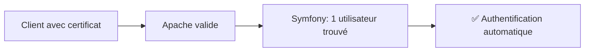
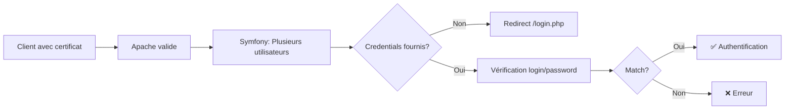
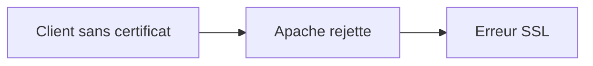

# Architecture d'Authentification X.509

## Vue d'ensemble

L'authentification s'effectue en deux étapes :
1. **Apache** valide le certificat client X.509 et expose les informations au serveur
2. **Symfony Security** utilise ces informations pour identifier et authentifier l'utilisateur

```
┌──────────────────────────────────────────────────────────────────┐
│                         FLUX GLOBAL                              │
└──────────────────────────────────────────────────────────────────┘

 Client HTTPS              Apache                 Symfony Security
    │                        │                           │
    │   Connexion TLS        │                           │
    │  + Certificat X.509    │                           │
    ├───────────────────────>│                           │
    │                        │                           │
    │                        │  Validation du certificat │
    │                        │  (SSLVerifyClient)        │
    │                        │                           │
    │                        │  Variables d'environnement│
    │                        │  SSL_CLIENT_*             │
    │                        ├──────────────────────────>│
    │                        │                           │
    │                        │         Authentification  │
    │                        │         X509Authenticator │
    │                        │                           │
    │     Page authentifiée  │                           │
    │<───────────────────────┴───────────────────────────┘
```

---

## Étape 1 : Configuration Apache

### Validation du certificat client (VirtualHost :8443)

Apache est configuré pour exiger un certificat client valide sur le port HTTPS 8443 :

```apache
SSLEngine on
SSLVerifyClient require          # Certificat client obligatoire
SSLVerifyDepth 5                 # Profondeur de vérification
SSLCACertificatePath /etc/s2low/ssl/validca
SSLCARevocationPath /etc/s2low/ssl/validca
SSLCARevocationCheck chain       # Vérification CRL
SSLOptions +StdEnvVars +OptRenegotiate +ExportCertData +LegacyDNStringFormat
```

**Résultat** : Apache vérifie que :
- Le certificat est signé par une CA reconnue (`SSLCACertificatePath`)
- Le certificat n'est pas révoqué (CRL)
- La chaîne de certification est valide

### Variables d'environnement exposées

Si la validation réussit, Apache expose les informations via des variables d'environnement PHP :

| Variable               | Description                                   |
|------------------------|-----------------------------------------------|
| `SSL_CLIENT_VERIFY`    | Résultat : `SUCCESS` ou autre                 |
| `SSL_CLIENT_S_DN`      | Subject DN du certificat                      |
| `SSL_CLIENT_I_DN`      | Issuer DN du certificat                       |
| `SSL_CLIENT_CERT`      | Certificat complet en PEM                     |
| `SSL_CLIENT_M_SERIAL`  | Numéro de série (pour calcul du hash)        |

Ces variables sont ensuite lues par Symfony.

---

## Étape 2 : Symfony Security

### Configuration du firewall (`config/packages/security.yaml`)

```yaml
security:
    providers:
        app_user_provider:
            id: S2low\Security\SecurityUserProvider

    firewalls:
        main:
            lazy: true
            stateless: false
            provider: app_user_provider
            custom_authenticators:
                - S2low\Security\X509Authenticator  # Authenticator principal
            logout:
                path: app_logout
                target: /
```

**Principe** : Symfony Security utilise un **Custom Authenticator** qui implémente `AuthenticatorInterface`. Cet authenticator analyse les variables `SSL_CLIENT_*` pour identifier l'utilisateur.

### Architecture de l'authenticator

L'authentification est structurée autour de **4 composants** suivant le principe de responsabilité unique :

```
┌─────────────────────────────────────────────────────────────────┐
│                      X509Authenticator                          │
│              (Orchestre le processus d'authentification)        │
└───────────────┬─────────────────────────────────────────────────┘
                │
                ├──► CertificateExtractor
                │    (Extraction et validation du certificat)
                │
                ├──► CredentialsExtractor
                │    (Extraction des credentials login/password)
                │
                └──► UserAuthenticationStrategy
                     (Stratégies d'authentification)
```

---

## Flux d'authentification détaillé

### Cycle de vie d'une requête

```
┌──────────────────────────────────────────────────────────────┐
│  1. Apache valide le certificat                              │
│     → SSL_CLIENT_VERIFY = 'SUCCESS'                          │
└────────────────────────┬─────────────────────────────────────┘
                         │
                         ▼
┌──────────────────────────────────────────────────────────────┐
│  2. Symfony Security appelle supports()                      │
│     ├─ Certificat valide?                                    │
│     ├─ Page GET /login.php? (skip)                           │
│     └─ User déjà authentifié? (skip sauf POST login)         │
└────────────────────────┬─────────────────────────────────────┘
                         │ [OUI]
                         ▼
┌──────────────────────────────────────────────────────────────┐
│  3. authenticate() - Tentatives d'authentification           │
│                                                              │
│     A. Nonce (lien temporaire)                               │
│        └─ Paramètres ?nounce/?login/?hash présents?         │
│           → Vérification + association certificat            │
│                                                              │
│     B. Certificat seul                                       │
│        └─ Recherche utilisateurs par hash certificat         │
│           ├─ 1 utilisateur → Authentification immédiate      │
│           └─ Plusieurs → Nécessite credentials              │
│                                                              │
│     C. Certificat + Credentials                              │
│        └─ Login/password fournis?                            │
│           → Vérification via PasswordHandler                 │
└────────────────────────┬─────────────────────────────────────┘
                         │
                         ▼
┌──────────────────────────────────────────────────────────────┐
│  4. Résultat                                                 │
│     ✅ Succès → Session créée                                │
│     ❌ Erreur → Redirection /login.php                       │
└──────────────────────────────────────────────────────────────┘
```

---

## Composants de l'authenticator

### 1. X509Authenticator (`src/Security/X509Authenticator.php`)

**Rôle** : Orchestrateur principal implémentant `AuthenticatorInterface`.

**Méthodes clés** :
- `supports(Request)` : Détermine si la requête doit être authentifiée
- `authenticate(Request)` : Exécute les stratégies d'authentification
- `onAuthenticationSuccess()` : Gère les redirections après succès
- `onAuthenticationFailure()` : Gère les erreurs et redirections

### 2. CertificateExtractor (`src/Security/CertificateExtractor.php`)

**Rôle** : Extraction et validation des informations du certificat X.509.

**Vérifications** :
- `SSL_CLIENT_VERIFY === 'SUCCESS'`
- Extraction du hash (via `openssl_x509_parse`)
- Support des certificats RGS 2★ via header `org-s2low-forward-x509-identification`

**Données extraites** :
```php
[
    'ssl_client_verify' => 'SUCCESS',
    'subject_dn' => 'CN=...',
    'issuer_dn' => 'CN=...',
    'certificate_hash' => 'A1B2C3...',  // Hash SHA1
    'ssl_client_cert' => '-----BEGIN CERTIFICATE-----...',
    'certificate_rgs_2_etoiles' => '...'  // Optionnel
]
```

### 3. CredentialsExtractor (`src/Security/CredentialsExtractor.php`)

**Rôle** : Extraction des credentials utilisateur (login/password).

**Sources** :
- HTTP Basic Auth : `PHP_AUTH_USER` / `PHP_AUTH_PW`
- POST data : Formulaire de login

### 4. UserAuthenticationStrategy (`src/Security/UserAuthenticationStrategy.php`)

**Rôle** : Stratégies d'authentification avec priorité définie.

#### Stratégie A : Authentification par nonce (liens temporaires)
- URL : `/page?nounce=XXX&login=user&hash=YYY`
- Vérifie le nonce via `NounceSQL::verify()` et associe certificat + authorityId

#### Stratégie B : Authentification par certificat seul
```php
authenticateByCertificate($certificateHash, $certificateRgs2)
```
- Recherche les utilisateurs associés au certificat
- ✅ **1 utilisateur** → Authentification automatique
- ⚠️ **Plusieurs utilisateurs** → Retourne `null` (credentials requis)
- ❌ **Aucun utilisateur** → Exception

#### Stratégie C : Authentification par certificat + credentials
```php
authenticateByCertificateAndCredentials($certificateHash, $certificateRgs2, $login, $password)
```
- Recherche par certificat + login
- Vérifie le mot de passe avec `PasswordHandler::passwordMatchesHash()`
- ✅ **Match** → Retourne l'utilisateur
- ❌ **Erreur** → Exception (`login_incorrect` / `password_incorrect`)

---

## Scénarios d'authentification

### Scénario 1 : Utilisateur unique avec certificat



**Expérience utilisateur** : Navigation transparente, pas de formulaire de login.

### Scénario 2 : Plusieurs comptes pour un certificat



**Expérience utilisateur** : Redirection vers formulaire pour choisir le compte.

### Scénario 3 : Sans certificat



**Expérience utilisateur** : Erreur de connexion au niveau du navigateur (avant Symfony).

---

## Gestion des erreurs

| Code Erreur          | Signification                          | Redirection                      |
|----------------------|----------------------------------------|----------------------------------|
| `multiple_accounts`  | Plusieurs comptes pour ce certificat   | `/login.php` (formulaire)        |
| `login_incorrect`    | Login inconnu pour ce certificat       | `/login.php?error=login_...`     |
| `password_incorrect` | Mot de passe incorrect                 | `/login.php?error=password_...`  |
| Aucun compte         | Certificat non enregistré              | Exception                        |

---

## Points techniques

### Sécurité
- Validation stricte : `SSL_CLIENT_VERIFY === 'SUCCESS'`
- Vérification des mots de passe via `PasswordHandler::passwordMatchesHash()`
- Certificats RGS 2★ décodés depuis Base64
- Vérification CRL activée dans Apache

### Sessions
- Pas de ré-authentification si user déjà en session (sauf POST login ou environnement test)
- Token stocké dans `TokenStorageInterface` de Symfony

### Logging
- Toutes les tentatives d'authentification sont loguées
- Cas "multiple accounts" tracés avec le nombre de comptes

---

## Tests

Les tests unitaires se trouvent dans `test/PHPUnit/Security/X509AuthenticatorTest.php` :

- ✅ Supports avec/sans certificat
- ✅ Page login (GET) non supportée
- ✅ Authentification avec 1 utilisateur
- ✅ Authentification avec plusieurs utilisateurs + credentials
- ✅ Gestion des erreurs (login/password incorrect)
- ✅ Redirections de succès/échec
