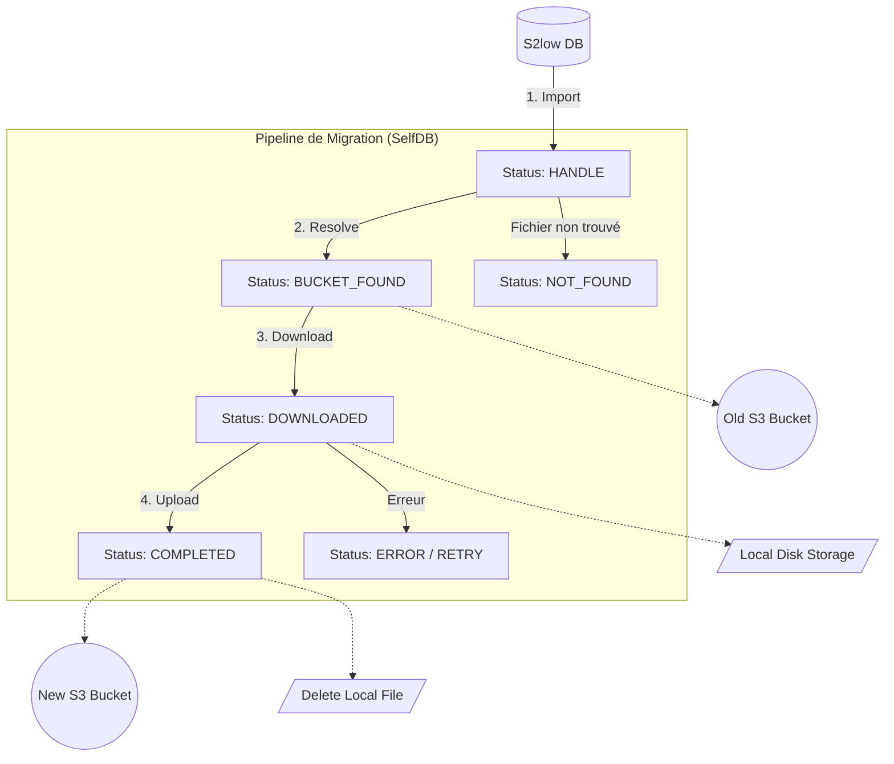

# Workflow de Migration S3

Ce document détaille le fonctionnement interne du pipeline de migration, les différents états d'une transaction et comment le script gère le flux de données.

## Architecture du Pipeline

Le script utilise une base de données PostgreSQL locale (appelée `SelfDB`) pour orchestrer la migration. Cela permet de :
- Suivre l'état de chaque fichier individuellement.
- Reprendre la migration en cas de coupure (crash-proof).
- Garantir qu'**un seul fichier** est traité à la fois sur le disque local (économie d'espace disque).

### Diagramme de flux

## Les États des Transactions

La table locale `transactions` suit l'avancement de chaque fichier via la colonne `status`. Voici la signification de chaque état :

| Statut | Description | Prochaine étape |
| :--- | :--- | :--- |
| `HANDLE` | Transaction importée depuis S2low, prête à être traitée. | `resolve` |
| `BUCKET_FOUND` | Le bucket source S3 a été identifié avec succès. | `download` |
| `DOWNLOADED` | Le fichier est présent sur le disque local (répertoire `/data`). | `upload` |
| `COMPLETED` | Le fichier a été envoyé sur le nouveau S3 et supprimé localement. | Aucune (Terminé) |
| `ERROR` | Une erreur est survenue (S3 inaccessible, fichier corrompu, etc.). | Analyse manuelle |
| `ASK` | (Variante de `BUCKET_FOUND`) Utilisé pour relancer manuellement un téléchargement. | `download` |

---

## Les Étapes en Détail

### 1. Import (`--step=import`)
Le script interroge la base de données S2low (Actes, Helios, Mailsec) pour identifier les transactions à migrer.  
Elles sont injectées dans la table locale `migration_s3` avec le statut `HANDLE`.

### 2. Resolve (`--step=resolve`)
Pour chaque transaction `HANDLE`, le script doit déterminer dans quel bucket S3 source le fichier se trouve réellement (le S2low historique pouvant utiliser plusieurs buckets).
- Si trouvé : Passage en `BUCKET_FOUND`.
- Si absent du S3 : Passage en `NOT_FOUND`.

### 3. Download (`--step=download`)
Le fichier est téléchargé depuis le bucket source vers le répertoire `/data` du conteneur.
- Une fois le téléchargement terminé avec succès, le statut passe à `DOWNLOADED`.

### 4. Upload (`--step=upload`)
Le fichier présent sur le disque est envoyé vers le nouveau stockage S3.
- Après confirmation de l'envoi, le fichier local est **immédiatement supprimé**.
- Le statut passe à `COMPLETED`.

---

## Le Mode Daemon (`--step=daemon`)

Le mode `daemon` est la méthode recommandée pour la production. Il exécute une boucle infinie avec un système de **priorités inversées** pour éviter l'engorgement du disque :

1. **Priorité Haute : Upload**  
   Si un fichier est présent sur le disque (`DOWNLOADED`), il est envoyé et supprimé en priorité.
2. **Priorité Moyenne : Download**  
   Si le disque est vide, on télécharge le prochain fichier en attente (`BUCKET_FOUND`).
3. **Priorité Basse : Resolve & Import**  
   Si rien n'est prêt à être téléchargé, on résout les buckets ou on importe de nouvelles transactions depuis S2low.

### Pourquoi cette priorité ?
Cette approche garantit que même si le script s'arrête brutalement (crash du conteneur, reboot), la première chose qu'il fera au redémarrage sera de nettoyer le disque en terminant les uploads en attente.

---

## Commandes Utiles pour le Workflow

| Objectif | Commande |
| :--- | :--- |
| **Lancer tout le pipeline** | `make run args="--step=daemon"` |
| **Migrer seulement un type** | `make run args="--step=daemon --type=acte"` |
| **Forcer l'import récent** | `make run args="--step=import --min-date=2024-01-01"` |
| **Vérifier l'état de la base** | Accéder à la DB locale via un client SQL |

---

## Monitoring et Troubleshooting

- **Logs** : Les logs de sortie standard (stdout) indiquent chaque changement d'état.
- **Espace Disque** : Monitorer le dossier `/data`. En mode daemon, il ne devrait jamais contenir plus d'un fichier à la fois (sauf pendant le transfert).
- **Table `migration_s3`** : La colonne `last_error` contient le message d'erreur en cas d'échec d'une étape.
